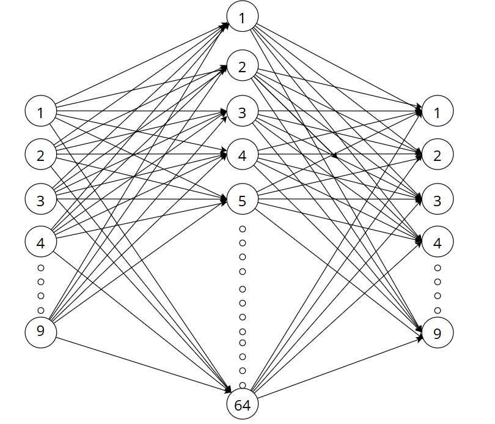
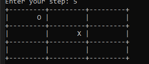

# Tic-Tac-Toe Neural Network
Небольшой проект на C++, в котором я реализовал нейронную сеть для игры в крестики-нолики.
За основу был взят персептрон с ветки MLP но были внесены корректировки:
- Функция активации выходного слоя ReLu -> SoftMax
- Уменьшено число входных/выходных нейронов -> 9
- Число нейронов на скрытом слое -> 64
  
# Что здесь есть
- многослойный перцептрон;
- обучение через backpropagation;
- Softmax;
- Cross-Entropy;
- Momentum / Velocity;
- генерация датасета из сыгранных партий;
- сохранение и загрузка весов;
- вывод игрового поля в консоли.

# Архитектура нейросети

# Как это работает
Состояние поля передаётся в нейросеть:
Игровое поле
     ↓
Input Layer
     ↓
Hidden Layer
     ↓
Output Layer
     ↓
Softmax
     ↓
Выбор хода
На выходе сеть получает вероятности для каждого возможного хода.
Например:
Move 0: 0.02
Move 1: 0.05
Move 2: 0.01
Move 3: 0.12
Move 4: 0.67
...
Выбирается ход с наибольшей вероятностью.
# Обучение
Для обучения используются уже сыгранные партии.
Ошибка выходного слоя:
target - output
Функция ошибки:
-loss = log(output[correctMove])
Для обновления весов используется Momentum / Velocity.
# Результат обучения
Для удобства loss выводится в процентах
- Размер датасета: 5000 различный партий
- Количество эпох: 42
- Epochs: 42
- Начальный Loss: 132.784
- Initial Loss: 132.784
- Конечный Loss: 5.03993
- Final Loss: 5.03993
# Пример поля

# Technologies
- C++
- STL
- Neural Networks
- Backpropagation
- CMake
