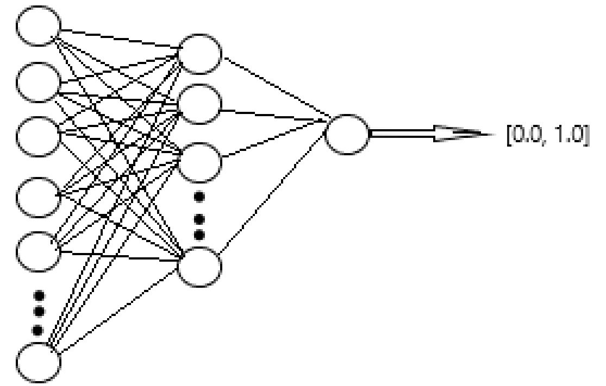

## Однойслойный персептрон

Вид нейросети:

Входных нейронов: 100
Нейронов скрытого слоя: 50
Выходных нейронов: 1

Строка делиться на слова до пробелов ,пропускается через хэш функцию и далее полученное число является идексом нейронона счет которого увеличеться на 1.

# Функция обучения: 

Формула градиентого спуска с Momentum: 

# w[t + 1] = w[t] - velocity[t + 1]

# velocity[t + 1] = $\beta$ * velocity[t] + $\alpha$ * $\gamma$ * X где 

$\beta$ - коэффицент инерции(от 0.0 до 1.0) 

$\alpha$ - скорость обучения

$\gamma$ - ошибка(Для выходного слоя: разница между ответом и эталоном. Для скрытого слоя: протащинная назад ошибка)

X - если скрытый слой: значение с входного нейрона , иначе # H .

H = f(z) , где f - функция активации 

z = ($x_1$ * $w_1$) + ($x_2$ * $w_2$) + ... + ($x_100$ * $w_100$) + bias 

# $$\gamma_i$$ = $$\gamma_out$$ * $w_outI$ * f'($z_i$) где 

$$\gamma_out$$ - ошибка с выходного нейрона 

$w_outI$ - вес связи этого нейрона с выходным нейроном 

f'($z_i$) - производная функции авктивации 

$z_i$ - значение выходного нейрона

# Функции Активации 

# Sigmoid 

1.0 / (1.0 + $e ^ {-z}$) , где z результат выходного нейрона

# Производная simoid

y * (1.0 - y) , где y результат sigmoid(z)

# ReLu

(h > 0) ? 1.0 : 0.0

